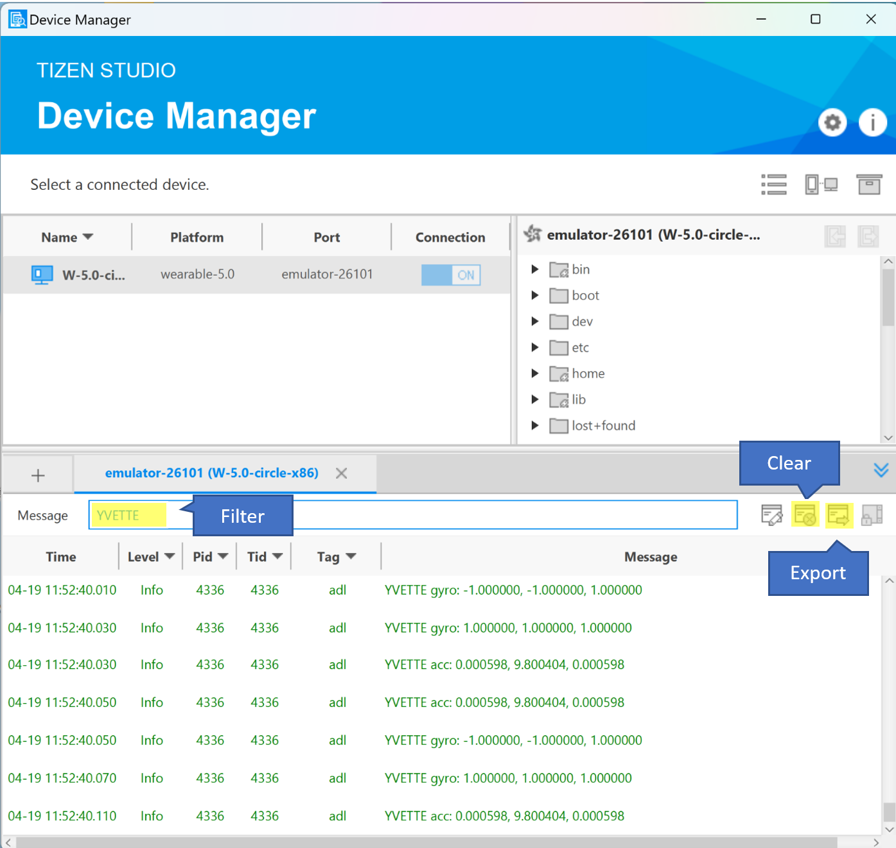

# ECE695_IoT
Project for ECE695

### Data Collection
## Setup
For this project we tested on 2 separate Samsung watches, both running on Tizen OS. A simple native app was created with a button to start and stop the collection of accelerometer and gyroscope data. Due to problems encountered accessing the watch file system, the motion data was logged and exported through the Tizen IDE's Device Manager. To only collect logs of interest, a filter was added before we ran any tests. The log was also cleared before every run, so that there would be no overlap between the data collected for each activity.

## Performing activities
The watch is primarily worn on the dominant hand, i.e. right handed people wear watch on their right hand. Before performing an activity, connect the watch to the Tizen IDE, once it is loaded open a voice recorder app on a nearby phone.
- Clear the log in the Device Manger
- Start the voice recording and wait 5 seconds then press the button on watch to start data collection
- Perform the activity of interest for 20 seconds (until voice recorder shows 25 seconds have elapsed)
- Click the button on the watch to stop data collection, then stop the voice recorder.
- Export the log and save as "activity_sessionNum.txt"
- Save the audio recording with the same name
- Clear the log in the Device Manager and prepare for the next activity

## Activities of interest
Due to time constraints we only looked at the following activities
- Writing
- Typing on keyboard
- Frying
- Sweeping

To investigate the effects of background noise and watch placement, for the first data collection session we had some music playing in the background, and for the second data collection session the watches were worn on the passive hand.

## Post processing of data

### References for paper we are attempting to reproduce:
Leveraging Sound and Wrist Motion to Detect Activities of Daily Living with Commodity Smartwatches
https://dl.acm.org/doi/pdf/10.1145/3534582

Dataset for that paper:
https://dataverse.tdl.org/dataset.xhtml?persistentId=doi:10.18738/T8/NNDFQD

Author of the original paper:
https://www.rebeccaadaimi.com/publications/audioimuwatch/

IEEE format for report:
https://www.ieee.org/conferences/publishing/templates.html
